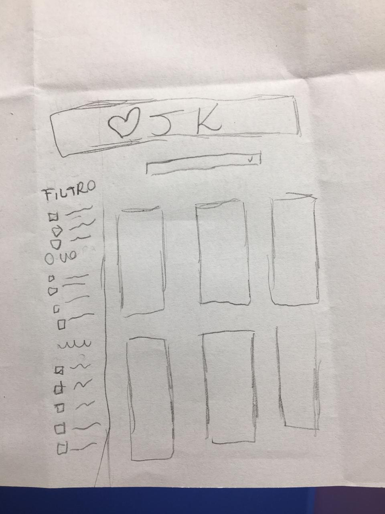
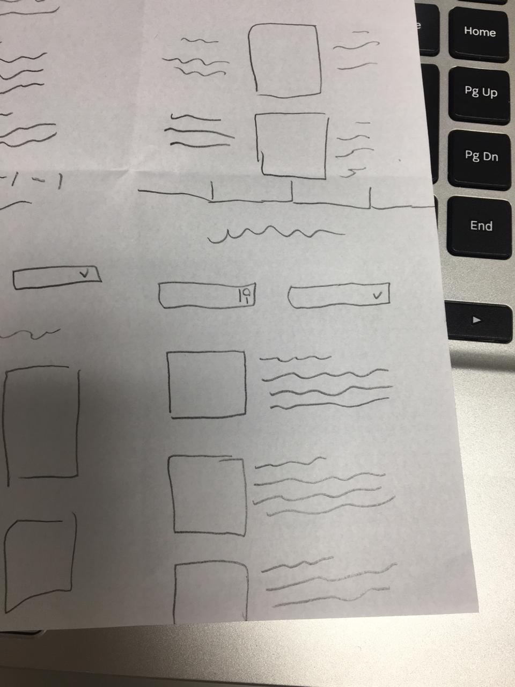

# Data Lovers

## Índice

* [1. Pokemon](#1-pokemon)
* [2. Resumo do projeto](#2-resumo-do-projeto)
* [3. Histórias do usuário](#3-historia-do-usuario)
* [4. Desenho da interface](#4-desenho-da-interface)
* [5. Testes de usabilidade](#5-testes-de-usabilidade)
* [6. Considerações Finais](#6-consideracoes-finais)

***

## 1. Pokemon

O [Pokemon](https://pt.wikipedia.org/wiki/Pokémon), é serie de desenhos animados japoneses que ficou muito famoso nos anos 90. O criador foi [Satoshi Tajiri](https://pt.wikipedia.org/wiki/Satoshi_Tajiri), Pokemon é sucesso até hoje, através de filmes e jogos, principalmente com o [Pokemon Go](https://pt.wikipedia.org/wiki/Pokémon_GO), jogo de realidade aumentada, que atualmente é o mais lucrativo do mundo. 

## 2. Resumo do projeto

Este projeto é uma aplicação Web com a finalidade de trazer informações de forma clara e rápida. 
A partir de histórias de usuários, conseguimos identificar as necessidades e elaboramos a solução adequada. O mesmo foi feito a partir: JavaScript, CSS e HTML.

## 3. Histórias do usuário

Nossa persona é: fã de jogos, assistiu Pokemon em sua infância adolescencia, Gosta de Tecnologia, idade de 24 à 40 anos, curioso.  

Mariana, 32 anos, mãe, fã de animes japoneses.

"Eu quero um site em que eu possa ver todos os pokemons."

**Critérios de Aceitação:** Página web responsiva com a lista completa dos  151 usuários.

Ricardo, 26 anos, designer, jogador de Pokemon Go.

"Seria util poder filtrar por tipos, nunca lembro de todos."

**Critérios de Aceitação:** Um menu na qual é possível listar por tipos e imprimir na tela, somente o que o usuário esta pesquisando.

Felipe, 24 anos, auxiliar administrativo, classe C.

"Eu gostaria de pesquisar os pokemons por nome, não gosto de olhar uma lista."
**Critérios de Aceitação:** Implementado um menu que filtra a partir do nome digitado.

Jackeline, 25 anos, aluna do Laboratoria, fez o teste de usabilidade.

"Achei confusa a disposição do filtro com a ordenação, parece que ele filtra e já ordena."
**Critérios de Aceitação:** Inserida mais 2 opções de ordenação, sendo assim pode ordenar tudo de AZ ou o a partir do filtro escolhido de AZ.

**Definição de pronto:** O código esta de acordo com o guia dos estilos. Código no repositório. Passa nos testes unitários. História implementada com 1 usuário.

## 4. Desenho da interface

Nosso primeira ideia de página em baixa fidelidade foi desenvolvido na primeira sprint. 
Consistia em um menu de filtro com todos os tipos e um menu para a navegação e todos os pokemons impressos na página.
O resultado ficou muito próximo do esperado.

## 5. Testes de usabilidade

Fizemos duas alterações principais após mostrar a usuários. A primeira foi em relação a ordenação.
Nosso menu de ordenação dava a entender ao usuário que iriamos filtrar e que posteriormente poderia ordernar os pokemons já filtrados. E a realidade é que clicando na opção de ordenação ele iria ignorar os filtrados e ordenaria de A-Z. A partir deste feedBack inserimos mais duas opções para filtrar e ordenar ao mesmo tempo.
A segunda alteração é que demos a opção ao usuário de filtrar a partir do nome, mas não informamos que era especificamente ao nome, nosso usuário tentou pesquisar a partir do número da Pokedex. Com esse feedBack inserimos a informação do nome.

## 6. Considerações Finais

O projeto foi desenvolvido pelas Estudantes da 3ª geração da Laboratoria, Joanilza e Katlyn. Foi um desafio assustador no inicio e que pouco a pouco clareando e se tornando divertido. Agradecemos a Laboratoria pela parceria e atenção.

